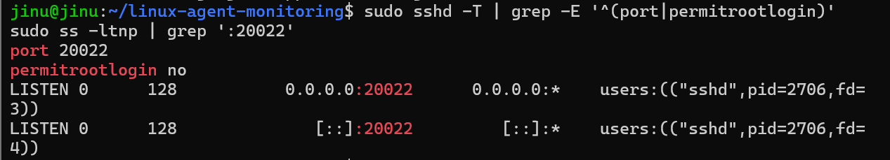
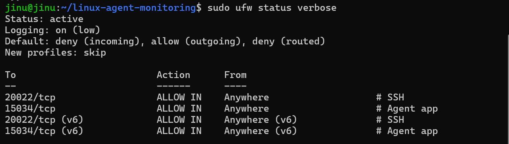
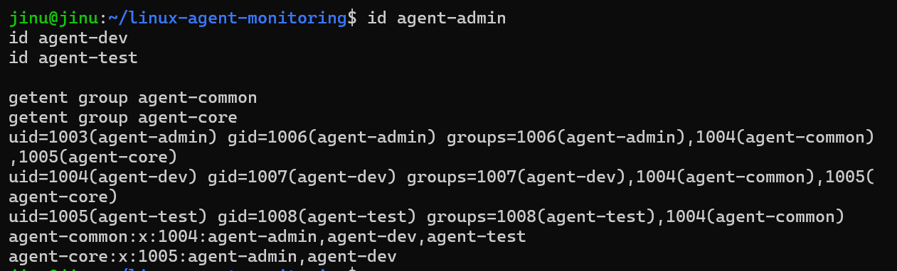
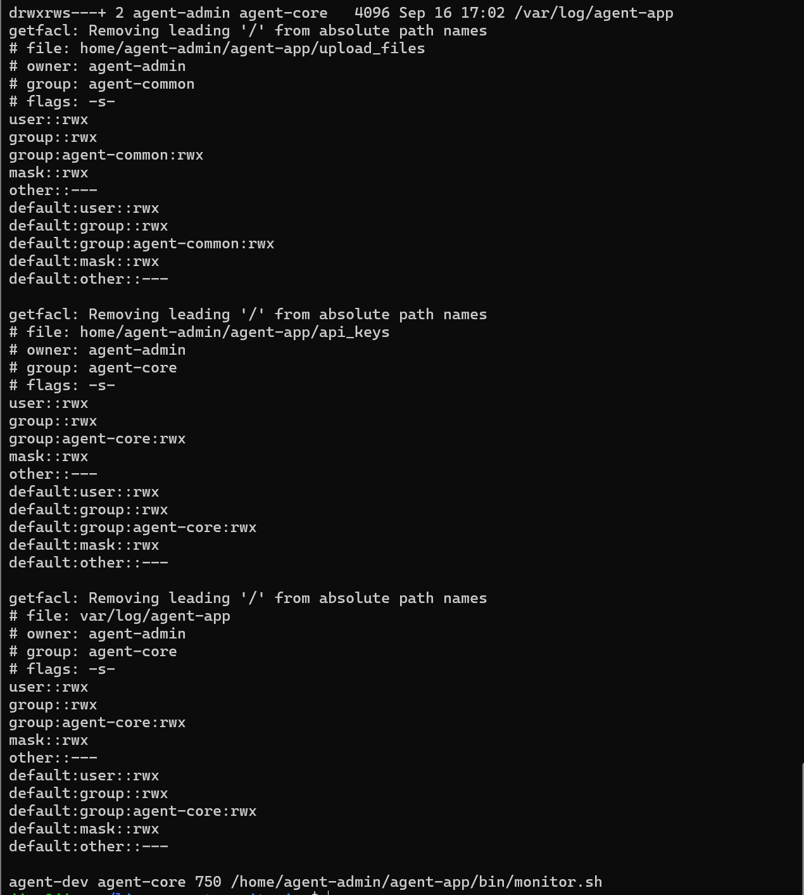
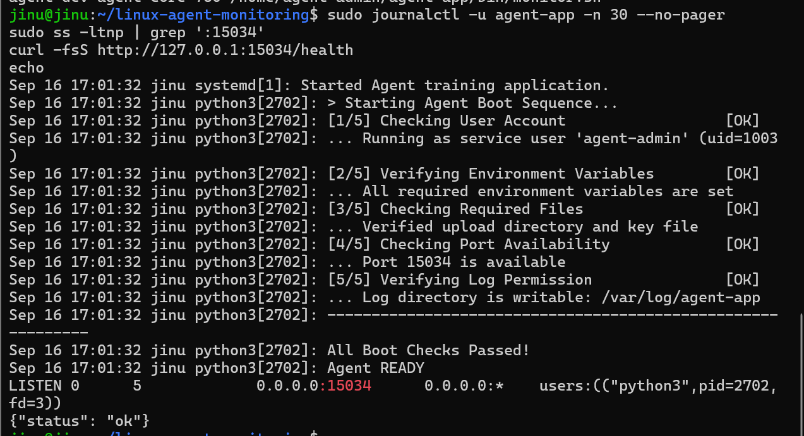
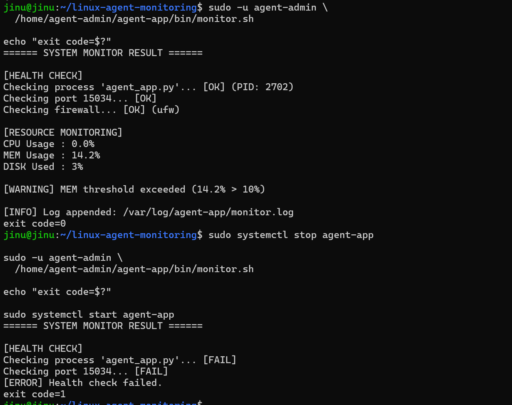
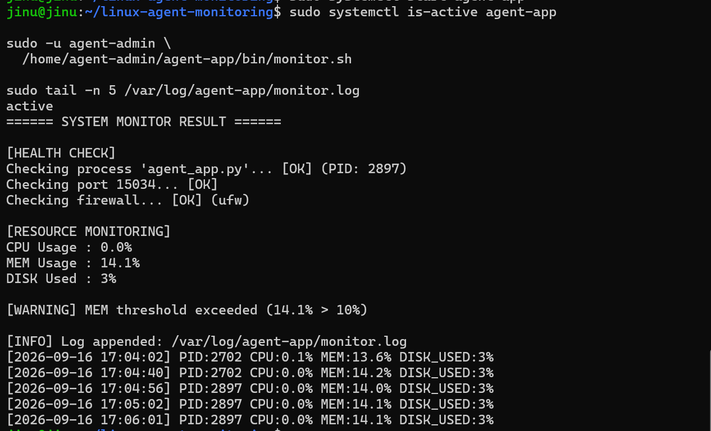
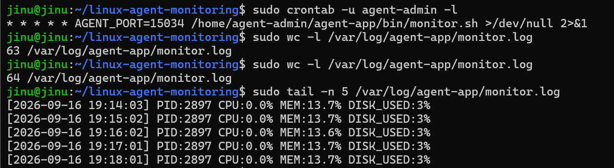
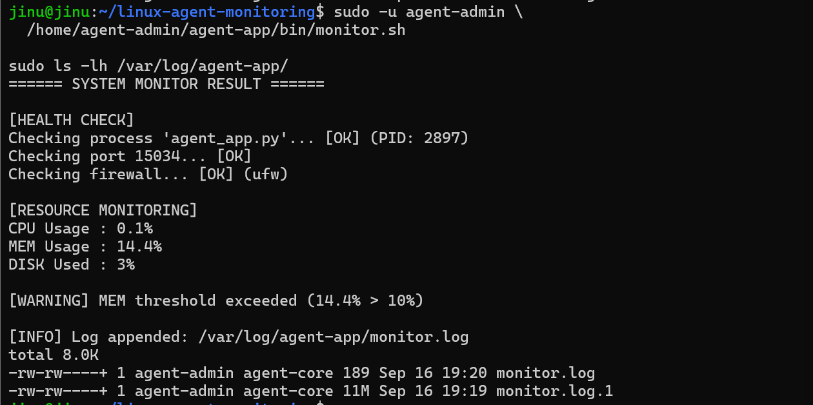

# WSL2 Ubuntu 실행 증빙 — 항목 1~9

이 문서는 Windows의 WSL2 Ubuntu 환경에서 실제로 명령을 실행한 결과를 항목별로 정리한 것입니다. 각 캡처 아래에는 명령이 확인하는 내용과 결과의 의미를 쉽게 설명했습니다.

## 한눈에 보기

| 항목 | 확인 대상 | 결과 |
|---|---|---|
| 1 | SSH 20022 포트, Root 원격 로그인 차단 | 정상 |
| 2 | UFW 활성화, 20022·15034 포트만 허용 | 정상 |
| 3 | agent 계정 3개와 역할별 그룹 | 정상 |
| 4 | 공유·보안 디렉터리 ACL, monitor.sh 권한 | 정상 |
| 5 | 앱 Boot Sequence 5단계와 15034 LISTEN | 정상 |
| 6 | monitor.sh 정상·장애 Health Check | 정상 |
| 7 | monitor.log 누적 기록 | 정상 |
| 8 | agent-admin cron 매분 실행과 로그 증가 | 정상 |
| 9 | 10MiB 초과 로그의 용량 기반 회전 | 정상 |

## 1. SSH 포트 변경과 Root 원격 로그인 차단



### 실행한 확인

- `sshd -T`로 SSH 서버에 실제 적용된 설정을 조회했습니다.
- `ss`로 SSH 서버가 TCP 20022 포트에서 연결을 기다리는지 확인했습니다.

### 결과 설명

`port 20022`가 출력되므로 SSH 포트 변경이 적용됐습니다. `permitrootlogin no`는 Root 계정의 직접 원격 접속이 차단됐다는 뜻입니다. IPv4 `0.0.0.0:20022`와 IPv6 `[::]:20022`가 모두 `LISTEN` 상태이므로 SSH 서버가 정상적으로 포트를 열고 있습니다.

## 2. UFW 방화벽 활성화와 허용 포트 제한



### 실행한 확인

`ufw status verbose`로 방화벽 활성화 상태, 기본 정책, 허용 포트를 확인했습니다.

### 결과 설명

`Status: active`이므로 UFW가 동작 중입니다. 기본 인바운드는 `deny`이며, SSH용 20022/tcp와 앱용 15034/tcp만 허용됐습니다. `(v6)` 항목은 같은 규칙이 IPv6에도 적용된 것으로 중복 설정 오류가 아닙니다.

## 3. 계정과 역할별 그룹 구성



### 실행한 확인

`id`로 각 사용자의 소속 그룹을 확인하고, `getent group`으로 그룹의 전체 구성원을 확인했습니다.

### 결과 설명

- `agent-common`: agent-admin, agent-dev, agent-test 모두 포함되어 공용 업로드 공간을 함께 사용합니다.
- `agent-core`: agent-admin, agent-dev만 포함되어 키와 운영 로그 같은 민감 자원에 접근합니다.
- agent-test는 agent-core에 없으므로 민감 영역에 접근할 수 없습니다.

## 4. 디렉터리 ACL과 monitor.sh 권한



### 실행한 확인

`getfacl`로 현재 ACL과 새 파일에 상속될 기본 ACL을 확인하고, `stat`으로 monitor.sh의 소유자·그룹·권한을 확인했습니다.

### 결과 설명

`upload_files`는 agent-common에 `rwx`가 있어 세 역할이 공동 작업할 수 있습니다. `api_keys`와 `/var/log/agent-app`은 agent-core에만 `rwx`가 있고 `other::---`이므로 일반 사용자는 접근할 수 없습니다. `default:` ACL은 이후 생성되는 파일에도 같은 정책을 상속합니다. monitor.sh는 요구사항대로 `agent-dev:agent-core`, 권한 `750`입니다. `Removing leading '/'` 문구는 절대경로를 표시할 때 나오는 안내이며 오류가 아닙니다.

## 5. 애플리케이션 Boot Sequence와 포트



### 실행한 확인

systemd journal에서 앱 부팅 로그를 보고, `ss`로 15034 포트, `curl`로 `/health` 응답을 확인했습니다.

### 결과 설명

사용자, 환경 변수, 필수 파일, 포트 가용성, 로그 권한의 5단계가 모두 `[OK]`입니다. 마지막에 `Agent READY`가 출력됐고 `0.0.0.0:15034`가 LISTEN 상태입니다. `/health`도 `{"status": "ok"}`를 반환하므로 앱이 실제 요청에 응답합니다.

## 6. monitor.sh 정상 및 장애 감지



### 정상 상태

앱 프로세스와 15034 포트, UFW가 모두 `[OK]`이고 종료 코드는 `0`입니다. CPU·메모리·디스크 값을 수집하고 로그도 정상적으로 추가했습니다. 메모리 14.2%는 기준 10%를 초과했기 때문에 `[WARNING]`이 출력됐지만, 경고 항목은 모니터링을 계속하도록 설계되어 정상 종료합니다.

### 장애 상태

`systemctl stop agent-app`으로 앱을 중지한 뒤 실행하자 프로세스와 포트가 모두 `[FAIL]`이 됐고 종료 코드 `1`을 반환했습니다. 즉, 서비스 불능 상태를 정상 실행과 구분할 수 있습니다. 테스트 후에는 `systemctl start agent-app`으로 앱을 다시 시작했습니다.

## 7. monitor.log 누적 기록



### 실행한 확인

앱이 `active`인지 확인한 후 monitor.sh를 실행하고 `/var/log/agent-app/monitor.log`의 최근 5줄을 조회했습니다.

### 결과 설명

각 로그에는 시간, PID, CPU, 메모리, 루트 디스크 사용률이 한 줄로 기록됩니다. 이전 로그가 사라지지 않고 여러 줄로 남아 있으므로 `>>` 방식의 누적 기록이 정상입니다. `17:05:02`와 `17:06:01`처럼 약 1분 간격의 기록도 확인됩니다.

## 8. cron 매분 자동 실행



### 실행한 확인

`crontab -u agent-admin -l`로 실제 등록된 작업을 조회하고, 시간 간격을 두고 `wc -l`로 monitor.log의 행 수를 두 번 비교했습니다. 마지막으로 최근 로그를 조회해 기록 시각도 확인했습니다.

### 결과 설명

crontab에 다음 작업이 등록되어 있습니다.

```cron
* * * * * AGENT_PORT=15034 /home/agent-admin/agent-app/bin/monitor.sh >/dev/null 2>&1
```

맨 앞의 별표 5개는 모든 분에 한 번 실행한다는 의미입니다. 로그 행 수가 `63`에서 `64`로 증가했고, 최근 기록도 `19:14:03`, `19:15:02`, `19:16:02`, `19:17:01`, `19:18:01`처럼 약 1분 간격으로 이어집니다. 따라서 agent-admin의 cron이 monitor.sh를 매분 자동 실행하고 로그를 누적한다는 것을 확인할 수 있습니다.

`>/dev/null 2>&1`은 cron이 출력하는 표준 출력과 오류 출력을 버린다는 의미입니다. 실제 모니터링 결과는 monitor.sh가 `/var/log/agent-app/monitor.log`에 직접 기록하므로 cron 메일이나 불필요한 출력이 쌓이지 않습니다.

## 9. 10MiB 기준 로그 회전



### 실행한 확인

monitor.log를 테스트용으로 11MiB까지 확장한 상태에서 monitor.sh를 실행하고, `/var/log/agent-app/` 디렉터리의 파일 크기와 이름을 확인했습니다.

### 결과 설명

기존 11MiB 로그가 `monitor.log.1`로 이동했고, 새 활성 로그인 `monitor.log`에는 이번 실행 결과가 189바이트로 기록됐습니다. 이는 스크립트가 기록 전에 10MiB 초과 여부를 검사하고 정상적으로 첫 번째 회전을 수행했다는 증거입니다.

두 파일 모두 소유자는 `agent-admin`, 그룹은 `agent-core`이며 그룹 쓰기가 가능한 권한을 유지합니다. 파일명 끝의 `+`는 ACL이 적용되어 있다는 뜻입니다. 화면의 `total 8.0K`는 `truncate`가 만든 희소 파일의 실제 디스크 할당량이고, `11M`은 파일의 논리적 크기이므로 서로 다르게 표시될 수 있습니다.

회전 시 기존 보관본은 `.1`에서 `.10` 방향으로 순서대로 이동하고, 가장 오래된 `.10`은 삭제합니다. 따라서 활성 `monitor.log`와 별도로 회전본을 최대 10개까지만 유지하여 로그가 디스크를 무제한 사용하지 않게 합니다.

## 최종 확인

항목 1~9의 실행 증빙을 모두 확인했습니다. 보너스 문제를 제외한 SSH, 방화벽, 계정·그룹·ACL, 앱 부팅, Health Check, 자원 수집, 로그 누적, cron 자동 실행, 용량 기반 로그 회전 요구사항이 WSL2 Ubuntu 환경에서 정상적으로 동작합니다.
